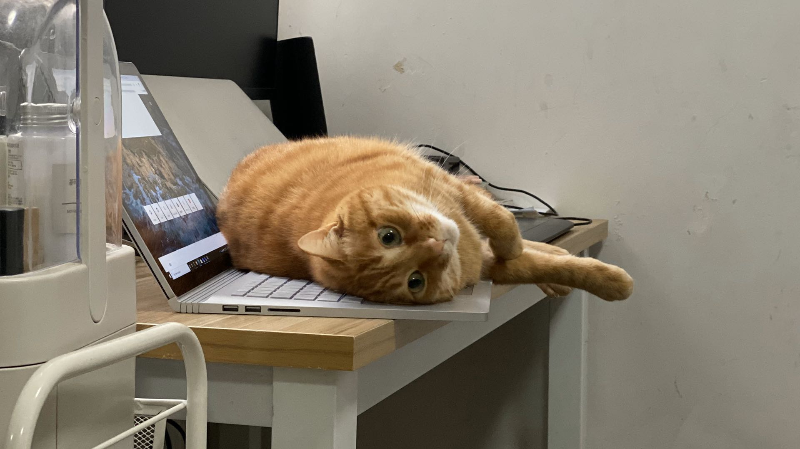

# KatBoard

I have two naughty cats, they enjoy playing on my keyboard.

Everybody who has cat suffers from these sweet moments until I have **KatBoard**

## Usage

1. Download latest release from [https://github.com/nodew/KatBoard/releases](https://github.com/nodew/KatBoard/releases)

2. Unzip the release.

3. Double click setup.exe to setup.

4. Startup the app

## TODO
- [x] ~~Auto startup~~
- [x] ~~Singleton Instance~~
- [x] ~~Support customized shortcut to quick lock the keyboard~~
- [x] ~~Better publish/installation experience~~
- [x] ~~Migrate to .netcore 3.0~~