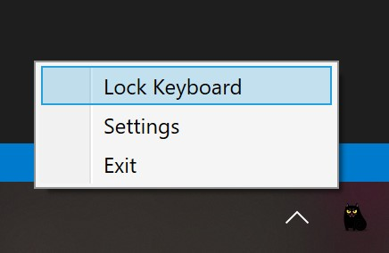
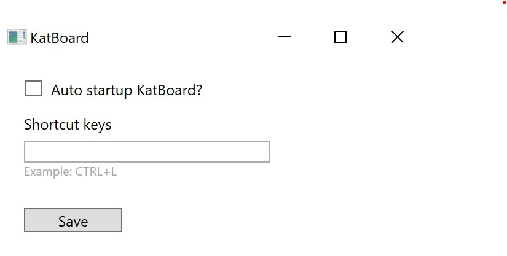

# KatBoard

I have two naughty cats, they enjoy playing on my keyboard.

Everybody who has cat suffers from these sweet moments until I have **KatBoard**

## Usage

1. Download latest release from [https://github.com/nodew/KatBoard/releases](https://github.com/nodew/KatBoard/releases)

2. Double click KatBoard.msi to setup the app.

3. Startup the app

    

4. Configuration, support auto startup and customized shortcut

    

## TODO
- [x] ~~Auto startup~~
- [x] ~~Singleton Instance~~
- [x] ~~Support customized shortcut to quick lock the keyboard~~
- [x] ~~Better publish/installation experience~~
